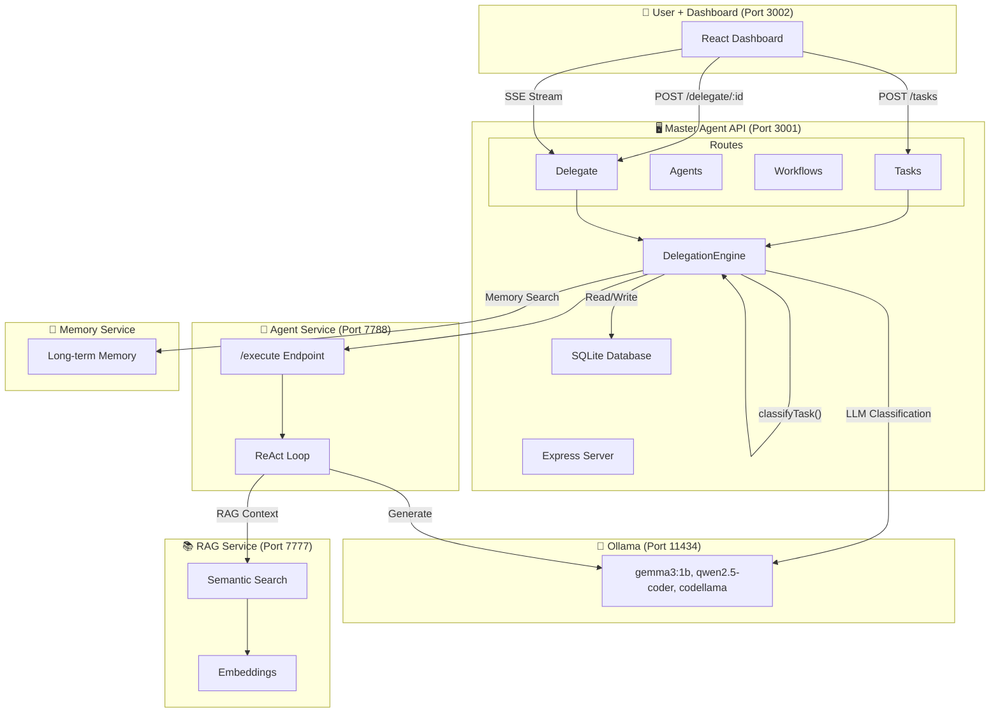

# Agent Workflow Diagram

## Current Architecture

```
┌─────────────────────────────────────────────────────────────────────────────────┐
│                              USER INTERFACE                                      │
│                          (Dashboard - Port 3002)                                 │
└─────────────────────────────────┬───────────────────────────────────────────────┘
                                  │
                                  ▼
┌─────────────────────────────────────────────────────────────────────────────────┐
│                           MASTER AGENT API                                        │
│                          (Express - Port 3001)                                  │
│  ┌─────────────┐  ┌──────────────┐  ┌─────────────┐  ┌────────────────────┐  │
│  │   Tasks     │  │   Agents     │  │  Workflows  │  │  DelegationEngine │  │
│  │  Routes    │  │   Routes     │  │   Routes    │  │  - classifyTask()  │  │
│  └─────────────┘  └──────────────┘  └─────────────┘  │  - delegateTask()  │  │
│                                                      │  - executeDelegate()│  │
│  ┌──────────────────────────────────────────────────┐ │  - multi-agent     │  │
│  │              TaskDelegation Model               │ │    collaboration   │  │
│  │  (SQLite Database)                              │ └────────────────────┘  │
│  └──────────────────────────────────────────────────┘                          │
└─────────────────────────────────┬───────────────────────────────────────────────┘
                                  │
                    ┌─────────────┴─────────────┐
                    │                           │
                    ▼                           ▼
┌─────────────────────────────┐   ┌─────────────────────────────────────────────┐
│    AGENT SERVICE            │   │            SHARED RAG SERVICE               │
│    (Port 7788)             │   │            (Port 7777)                      │
│                             │   │                                             │
│  ┌───────────────────────┐ │   │  ┌─────────────────────────────────────┐ │
│  │  /execute endpoint     │ │   │  │  Semantic Search                    │ │
│  │  - ReAct Loop          │ │   │  │  - Embeddings (nomic-embed-text)    │ │
│  │  - Max 6 iterations   │ │   │  │  - Chunked context (k=8)           │ │
│  │  - SSE streaming      │ │   │  └─────────────────────────────────────┘ │
│  └───────────────────────┘ │   │                                             │
│            │                │   └─────────────────────────────────────────────┘
│            ▼                │
│  ┌───────────────────────┐ │
│  │    OLLAMA             │ │
│  │  (Port 11434)        │ │
│  │                       │ │
│  │  - gemma3:1b         │ │
│  │  - qwen2.5-coder     │ │
│  │  - codellama         │ │
│  └───────────────────────┘ │
└─────────────────────────────┘
```

## Task Delegation Flow (Detailed)

```
┌──────────┐     ┌──────────────┐     ┌─────────────────┐     ┌────────────────┐
│  User    │────▶│  Dashboard    │────▶│  Master Agent   │────▶│ Agent Service  │
│ Creates  │     │  (React UI)   │     │  /delegate     │     │  /execute     │
│  Task    │     │               │     │                │     │               │
└──────────┘     └──────────────┘     └─────────────────┘     └────────────────┘
                                         │                        │
                                         ▼                        ▼
                                ┌─────────────────┐     ┌────────────────┐
                                │ classifyTask()  │     │   ReAct Loop   │
                                │                 │     │                │
                                │ Phase 1:        │     │ 1. Thought     │
                                │   Keywords      │     │ 2. Action      │
                                │ Phase 2:        │     │ 3. Observation │
                                │   LLM Fallback  │     │ 4. Repeat      │
                                └─────────────────┘     └────────────────┘
                                         │
                                         ▼
                                ┌─────────────────┐
                                │ Select Agent     │
                                │                 │
                                │ - coding-agent  │
                                │ - email-agent   │
                                │ - etc.          │
                                └─────────────────┘
```

## Mermaid Diagram (Copy to mermaid.live)



## Status Transitions

```
┌─────────┐     ┌──────────┐     ┌─────────────┐     ┌──────────┐
│pending  │────▶│delegated │────▶│ in_progress │────▶│completed │
└─────────┘     └──────────┘     └─────────────┘     └──────────┘
     │              │                   │
     │              │                   ▼
     │              │              ┌────────┐
     │              │              │ review │ (human-in-loop)
     │              │              └───┬────┘
     │              │                  │
     │              │            ┌─────┴─────┐
     │              │            ▼           ▼
     │              │      ┌──────────┐ ┌──────────┐
     │              │      │  resume  │ │  failed  │
     │              │      └────┬─────┘ └──────────┘
     │              │           │
     ▼              ▼           ▼
┌────────┐    ┌──────────┐ ┌──────────┐
│cancelled│    │  failed   │ │completed │
└─────────┘    └──────────┘ └──────────┘
```

## Auto-Retry Flow

```
┌──────────┐     ┌──────────┐     ┌──────────┐     ┌──────────┐
│  First   │────▶│ Failed   │────▶│  Wait    │────▶│  Retry   │
│ Attempt  │     │          │     │  5s      │     │  #1      │
└──────────┘     └──────────┘     └──────────┘     └────┬─────┘
                                                            │
                              ┌───────────────────────────────┘
                              ▼
                        ┌──────────┐     ┌──────────┐     ┌──────────┐
                        │  Failed   │────▶│  Wait    │────▶│  Retry   │
                        │           │     │  10s     │     │  #2      │
                        └──────────┘     └──────────┘     └────┬─────┘
                                                                │
                                    MAX 2 RETRIES ─────────────┘
                                                                ▼
                                                        ┌──────────┐
                                                        │  Failed  │
                                                        │ Final    │
                                                        └──────────┘
```

## Clarification Flow (Human-in-the-Loop)

```
┌──────────┐     ┌──────────────┐     ┌─────────────────┐     ┌────────────────┐
│  Agent   │────▶│   Needs      │────▶│    Dashboard    │────▶│    User       │
│ Result   │     │ Clarification│     │    Shows       │     │   Provides    │
│          │     │              │     │    Modal       │     │   Answers     │
└──────────┘     └──────────────┘     └─────────────────┘     └───────┬────────┘
                                                                       │
                                                                       ▼
                                                          ┌────────────────────────┐
                                                          │ POST /clarify         │
                                                          │ (answers in body)     │
                                                          └───────────┬────────────┘
                                                                      │
                                                                      ▼
                                                          ┌────────────────────────┐
                                                          │ Resume Delegation     │
                                                          │ with context          │
                                                          └────────────────────────┘
```

## Recommended Improvements

### 1. Add Callback Webhooks for Task Completion
- **Current**: Polling / SSE
- **Proposed**: Webhook notifications

### 2. Add Agent-to-Agent Communication
- **Current**: Sequential handoff passes results manually
- **Proposed**: Direct agent messaging

### 3. Add Task Dependencies
- **Current**: All tasks independent
- **Proposed**: Dependency graph (Task B waits for Task A)

### 4. Add Built-in Agent Feedback Loop
- **Current**: Manual re-delegation
- **Proposed**: Self-improvement with result analysis

### 5. Add Priority Queue for Delegation
- **Current**: FIFO (First In, First Out)
- **Proposed**: Priority-based (urgent > high > medium > low)

### 6. Add Timeout Configuration Per Agent
- **Current**: Global timeout
- **Proposed**: Agent-specific timeouts

### 7. Add Task Templates Library
- **Current**: Manual task creation
- **Proposed**: Pre-built templates

## Implementation Priority

| Priority | Improvement | Effort | Impact |
|----------|-------------|--------|--------|
| High     | Task Dependencies | Medium | High |
| High     | Priority Queue | Medium | High |
| Medium   | Agent-specific Timeouts | Low | Medium |
| Medium   | Webhook Notifications | Medium | Medium |
| Medium   | Task Templates | Low | Medium |
| Low      | Agent-to-Agent Direct | High | High |
| Low      | Self-Healing Feedback | High | High |
